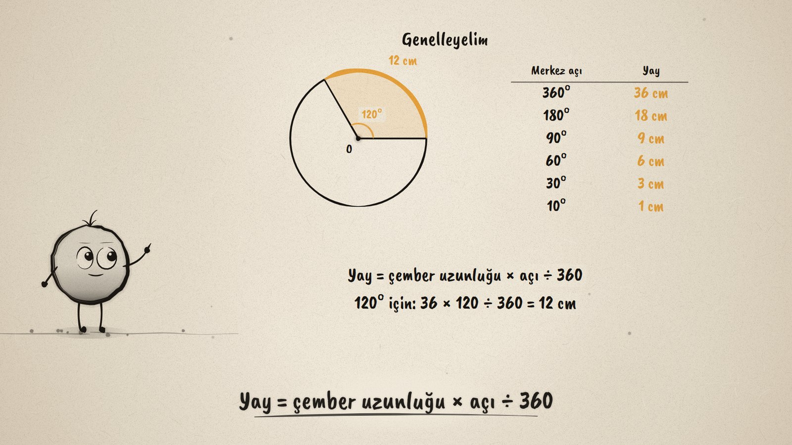
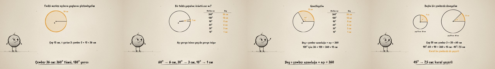

# Yay ve Açı · Central Angles and Arcs

**▶ Tarayıcıda izleyin / Watch in the browser:** https://hakanatas.github.io/yay-ve-aci/ 
**⬇ MP4 + altyazılar / MP4 + subtitles:** [Releases](https://github.com/hakanatas/yay-ve-aci/releases) 
**✎ Kullanılan istem / The prompt behind it:** [PROMPT.md](PROMPT.md) 
**🎞 Bütün filmler / All films:** [Nokta'nın Filmleri](https://hakanatas.github.io/nokta-filmleri/?sinif=6)

> **TR —** 6. sınıf matematik "Geometrik Nicelikler" temasındaki MAT.6.4.6 öğrenme çıktısı için hazırlanmış, tamamen JavaScript ile çizilen 92 saniyelik mürekkep animasyonu. Köşesi merkezde olan bir açı açılıyor ve bir yay görüyor. Çapı 12 cm olan çemberin uzunluğu, π yerine 3 alınınca 36 cm. Gözlem: 360° çemberin tamamını (36 cm), 180° yarısını (18 cm), 90° çeyreğini (9 cm) görüyor. Tabloya 60°, 30°, 10° da ekleniyor: 6, 3, 1 cm. Örüntü: açı yarıya inince yay da yarıya iniyor; bu çemberde her 10° için 1 cm. Genelleme: yay = çember uzunluğu × açı ÷ 360; 120° için 12 cm. Genelleme çapı 20 cm (uzunluğu 60 cm) olan başka bir çemberde sınanıyor: 90° için 15 cm, 45° için 7,5 cm. Altyazılar Türkçe, İngilizce ya da ikisi birlikte seçilebilir.

A 92-second ink animation for **6th-grade maths**, the last film of the fourth 6th-grade theme. Nokta, the ink character from [The Learning Ink](https://github.com/hakanatas/the-learning-ink), is the guide again. The arc label is computed from the angle being drawn (`sector` in `scenes/scene1.js`), so while the angle sweeps, its arc length counts along with it. Taking π as 3 makes the first circle 36 cm around, so the pattern (1 cm for every 10°) is easy to see before it is generalised.

## Learning outcome

MEB, Türkiye Yüzyılı Maarif Modeli, Ortaokul Matematik, 6th grade, "Geometrik Nicelikler" theme:

**MAT.6.4.6. Çemberde merkez açının ölçüsü ile gördüğü yayın uzunluğu arasındaki ilişkiye dair tümevarımsal akıl yürütebilme**
- a) Çemberde farklı ölçülere sahip merkez açıların gördüğü yayların uzunluklarına ilişkin gözlem yapar.
- b) Merkez açıların ölçüleri ile gördükleri yayların uzunlukları arasındaki ilişkiye dair örüntü bulur.
- c) Merkez açının ölçüsü ile gördüğü yayın uzunluğu arasındaki ilişkiye dair genelleme yapar.

## Scenes

| # | Time | Scene | What happens | Outcome |
|---|---|---|---|---|
| 1 | 0–10 s | Merkez açı | An angle at the centre opens and sees an arc. | a |
| 2 | 10–28 s | Gözlem | A circle 36 cm around: 360° is 36 cm, 180° is 18 cm, 90° is 9 cm. | a |
| 3 | 28–46 s | Örüntü | 60°, 30°, 10° → 6, 3, 1 cm; halve the angle, halve the arc; 1 cm for every 10°. | b |
| 4 | 46–64 s | Genelleme | Arc = circumference × angle ÷ 360; 120° gives 12 cm. | c |
| 5 | 64–80 s | Başka çember | A circle 60 cm around: 90° → 15 cm, 45° → 7.5 cm. | c |
| 6 | 80–92 s | Aklında kalsın | The arc grows with the angle. | b, c |

## Running it

- **Preview:** double-click `index.html` (it works offline).
- **MP4:** run `npm install` once, then `npm run export -- --format=horizontal --captions=tr`.
- **Subtitles and narration:** `npm run srt` writes `out/captions_*.srt` and `narration_notes.txt`.
- **Editing:**
  - Caption text, timings and narration notes: `captions.js`
  - Everything on screen is drawn by `LI.world(t)` in `scenes/scene1.js` (the sweeping angle in `KEYS`, the table, the second circle, the words); the other scenes only set the camera.
  - Circles and Nokta's poses: `src/draw/film.js`; layout for 16:9 and 9:16: `src/draw/kd.js`

It uses the same engine as The Learning Ink: `renderFrame(t)` as a pure function of time, seeded randomness, and frame-by-frame export.

## Lisans · License

**TR —** Bu film ve kodu [Creative Commons Atıf-GayriTicari 4.0 Uluslararası (CC BY-NC 4.0)](https://creativecommons.org/licenses/by-nc/4.0/deed.tr) lisansıyla paylaşılır. Ticari olmayan her amaçla (derste, okulda, eğitim materyalinde) kopyalayabilir, paylaşabilir ve değiştirebilirsiniz; ancak **kaynak göstermek zorunludur**: eser sahibinin adı ve bu deponun bağlantısı belirtilmeden kullanılamaz. Ticari kullanım (satış, ücretli ürün ya da yayın) için izin alınmalıdır.

**EN —** This film and its code are licensed under [Creative Commons Attribution-NonCommercial 4.0 International (CC BY-NC 4.0)](https://creativecommons.org/licenses/by-nc/4.0/). You may copy, share and adapt them for non-commercial purposes, but **attribution is required**: they may not be used without crediting the author and linking to this repository. Commercial use requires permission.

Atıf örneği / Required credit: *“Yay ve Açı”, Hakan Ataş, Nokta'nın Filmleri — https://github.com/hakanatas/yay-ve-aci — CC BY-NC 4.0*
